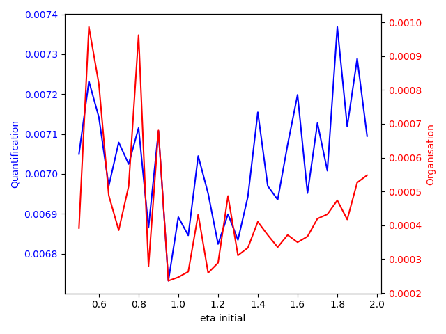
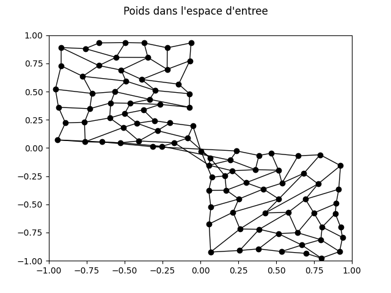

# Intelligence Artificielle Reseaux de neurones

$ \Delta w _{ij} = \eta * e^{-\frac{||j-j^{*}||^{2}_{c}}{2 \sigma ^{2}}} (x_{i} - w_{ji})$

## 3 Étude "théorique" de cas simples (7 points)

### 3.1 Influence de $\eta$

- si le taux d'apprentissage est de 0, la valeur des poids du neurone gagnant ne changera pas car $\Delta w _{ij} = \eta * [...]$

- si le taux d'apprentissage est 1, $ \Delta w _{ij} = 1 * e^{0} * (x_{i} - w_{ji}) = (x_{i} - w_{ji}) $ on modifie donc le poid du neurone gagnant de la difference entre ses poid est celui de l'entré. les poid du neurone gagnant deviennent donc celui de l'entré.

- le nouveau poids sera entre le poid initial et le poid de l'entré $ w _{ji} = w _{ji} + \eta(x_{i} - w_{ji}) = (1-\eta) w_{ji} + \eta x_{i}$

- si $ \eta > 1$ les poids du neurone gagnant depasse l'entré. ils passe de l'autre côté de l'entre. En quel que sorte le neurone a "trop appris" ...

### 3.2 Influence de $\sigma$

- si $ \sigma$ augmente, $\frac{||j-j^{*}||^{2}_{c}}{2 \sigma ^{2}}$ va diminuer et donc $e^{-\frac{||j-j^{*}||^{2}_{c}}{2 \sigma ^{2}}}$ va se raprocher de 1. L'influance de la distance sur $\Delta w _{ij}$ va donc diminuer. les neurones plus eloigné vont donc plus apprendre.

- beaucoup plus "resserrée" puisque tout les neurones seront affecté a chaque nouvelle entré.

-   
  - SOLUTION 1 : La variances des distances des poids des neurones par rapport au centre (moyenne des poids de tout les neurones). Avec $n$ le nombre de neurones et $x$ un vecteur de meme taille que $w_{j}$ tel que $x_{i}=\frac{1}{n}\sum_{j=1}^{n} w_{ji}$ --> mesure $=\frac{1}{n}\sum^{n}{(||x - w_{j}||^{2})}$
  - SOLUTION 2 : Apres reflexion, il me parrait plus judicieux de se baser sur la rapport entre la distance entre les neurones selon leurs coordonnés et selon leur poids. Pour ensuite calculer la variance de ces rapports. On calcule donc la moyenne avec $C_{j}$ (ou $C_{i}$) les coordonnées du neurones numero j (ou i) : 
  $Moy = \frac{n(n+1)}{2} \sum_{i=1}^{n}{\sum_{j=i+1}^{n}{\frac{d(W_{j},W_{i})}{d(C_{j},C_{i})}}}$
  $ Variance = \frac{n(n+1)}{2} \sum_{i=1}^{n}{\sum_{j=i+1}^{n}{(\frac{d(W_{j},W_{i})}{d(C_{j},C_{i})} - Moy)^{2}}}$

### 3.3 Influence de la distribution d'entrée

- deux entrées $X_1$ et $X_2$
  - les poids du neurone vont se stabiliser entre les poids de $X_1$ et $X_2$
  - les poids du neurone vont se stabiliser sur le segment entre $X_1$ et $X_2$ en ettant n fois plus proche de $X_1$.
  - les poids du neurone vont tendre vers la moyennes des poids contenus dans la BDD
- si le neurone est le neurone gagnant, il vas etre attiré par l'entrée. Sinon, cela vas dependre de sa distance avec le neurone gagant selon leurs coordonnés et de la diferance entre ses poids et ceux de l'entrée. Donc si deux neurone voisin on des poids tres different, lorsqu'un des deux sera le neurone gagant, l'autre sera enormement attiré par l'entré et les deux se rapprocheront fortement.
- les neurones vont donc se reaprtire de facon similaire a leur repartition selon leur coordonées.

## 4 Étude pratique

### 4.2 Implémentation

```python
def compute(self,x):
  self.y = numpy.sqrt(numpy.sum((self.weights-x)**2))

def learn(self,eta,sigma,posxjetoile,posyjetoile,x):
  self.weights[:] = self.weights + eta * numpy.exp(-((self.posx-posxjetoile)**2+(self.posy-posyjetoile)**2)/(2*sigma**2)) * (x - self.weights)

def organisation(self):
  ratio = []
  for posx1 in range(self.gridsize[0]):
    for posy1 in range(self.gridsize[1]):
      for posx2 in range(self.gridsize[0]):
        for posy2 in range(self.gridsize[1]):
          if(posx1 != posx2 or posy1 != posy2):
            d = numpy.sqrt(numpy.sum((self.map[posx1][posy1].weights - self.map[posx2][posy2].weights)**2))
            d2 = numpy.sqrt((posx1 - posx2)**2+(posy1 - posy2)**2)
            ratio.append(d/d2)
  return numpy.var(ratio)
```

### 4.3 Analyse de l'algorithme

#### les différents Samples

uniforme 1:


uniforme 2:


croix:


normale:


#### Test 1 : Nombre d'itérations

|$\eta$|$\sigma$|$N$|$Samples$|
|-|-|-|-|
|0.05|1.4|$x$|uniforme 1|


Je choisie de fixer n à 3000 pour la suite.

#### Test 2 : ajustement de $\eta$

|$\eta$|$\sigma$|$N$|$Samples$|
|-|-|-|-|
|x|1.4|3000|uniforme 1|


La quantification diminue jusqu'à eta = 0.15, elle commence ensuite à réaugmenter.

#### Test 3 : ajustement de $\sigma$

|$\eta$|$\sigma$|$N$|$Samples$|
|-|-|-|-|
|0.15|x|3000|uniforme 1|


Pour obtenir la meilleur quantification vectoriel, sigma devrais se situer vers 0.65. Mais l'organisation ne vas pas etre bonne et on vas obtenir des reseaux comme cela :

plus sigma augmente, plus les neurones seront resserrés. Cela vas permetre d'eviter les torsades comme ci-dessus mais cela vas en meme temps empecher les neuronnes de se raprocher des bords. La quantification Vectoriel sera alors moins bonne. Exemple de sigma trop haut :

Il pourrait etre interessant de faire diminuer $\sigma$ au file des iterations et en partant d'un $\sigma$ elevé qui nous assure une bonne organisation. par exemple en multipliant par 0.995 $\sigma$ toute les 10 iterations.

J'ajoute cela :

```python
if i%10==0:
      sigma = sigma * 0.995
```

Je regenere donc le graphique :

|$\eta$|$\sigma$|$N$|$Samples$|
|-|-|-|-|
|0.15|x|3000|uniforme 1|


Avec un $\sigma$ initial = 2 on obtient une tres bonne Quatification Vectoriel tout en gardant une bonne organisation.

#### Test 4 : Correction du $\eta$

Je refais varier $\eta$ avec $\sigma$ = 2 (et toujours avec la décroissance progressive de sigma)

|$\eta$|$\sigma$|$N$|$Samples$|
|-|-|-|-|
|x|2|3000|uniforme 1|


En diminuant peu à peu le $\eta$, les poids devraient se placer plus vite au début et se positionner avec plus de précision et moins d'aléatoire à la fin.
J'ai donc fait comme pour le $\sigma$ :

```python
if i%10==0:
      sigma = sigma * 0.995
      eta = eta * 0.995
```

Le test est concluant : nous avons de meilleurs résultats avec un $\eta$ initial de 1 qui décroît jusqu'à atteindre 0.22 à la 3000ème itération :


#### Test 5

Regardons à nouveau l'impact du nombre d'itérations après toutes ces modifications :

|$\eta$|$\sigma$|$N$|$Samples$|
|-|-|-|-|
|1|2|x|uniforme 1|


Exemple pour n = 5000 :


Exemple pour n = 3000 :


Au-delà de 3000, les graph précedant montre que l'organisation commence à se détériorer lentement.

#### Test sur Samples uniforme 2

|$\eta$|$\sigma$|$N$|$Samples$|
|-|-|-|-|
|1|2|3000|uniforme 2|

deux possibilitées :

- 
Quantification :  0.003294567980761774
Organisation :  0.004203590053562094

- 
Quantification :  0.003283026557254699
Organisation :  0.005158991097011461

J'essais de modifier la forme de la carte : Rectangle (20*5)

- 
Quantification :  0.003332281359420258
Organisation :  0.0017129187498005271

#### Test sur Samples croix

|$\eta$|$\sigma$|$N$|$Samples$|
|-|-|-|-|
|1|2|3000|croix|

- 
Quantification :  0.005493320636807738
Organisation :  0.0017998575345922285

J'essais de modifier la forme de la carte : carré (20*20)

- 
Quantification :  0.0011163258598912015
Organisation :  0.0004980471127643873

#### Test sur Samples normale

|$\eta$|$\sigma$|$N$|$Samples$|
|-|-|-|-|
|1|2|3000|normale|

- 
Quantification :  0.0068246084992035745
Organisation :  0.0015582771749716045

|$\eta$|$\sigma$|$N$|$Samples$|
|-|-|-|-|
|1|2|5000|normale|

En donnant plus d'itérations, les neurones pourront s'étaler un peu plus sur l'extérieur de la carte.

- 
Quantification :  0.004848382688749407
Organisation :  0.0020113951933119177

On peut obtenir de meilleurs résultats en allongeant encore le nombre d'itérations. Pour que cela soit vraiment utile, il faut aussi augmenter les facteurs qui multiplient eta et sigma toutes les 10 itérations. J'ai choisi de ne pas augmenter sigma autant que eta pour que les neurones se répartissent mieux.
J'ai aussi augmenté le nombre de neurones (15\*15).

|$\eta$|$\sigma$|$N$|$Samples$|
|-|-|-|-|
|1|2|6000|normale|

toute les 10 iteriations :
  eta = eta \* 0.997
  sigma = sigma \* 0.996

- 
Quantification :  0.002057100469142613
Organisation :  0.0010605735421881865

#### Conclusion du 4.3

Les parametres trouvé :
|$\eta$|$\sigma$|$N$|
|-|-|-|
|1 (\* 0.995 toute les 10 iterations)|2 (\* 0.995 toute les 10 iterations)|3000|

fonctionne plutot bien mais dé que l'on change de jeu de données, ces parameres ne sont plus addapté. par exemple sur le dernier jeu de données (normale) je suis obligé de faire des modifications pour que les poids soit plus etalé.
  
Aussi, dès que l'on modifie la forme/taille de la carte, les eta et sigma choisis ne fonctionnent plus bien. Les valeurs déterminées (surtout Sigma), permettent d'éviter quasiment à coup sûr une torsade sur le graphe des poids pour une carte 10\*10:

Mais sur une carte plus grande (20\*20):

sigma n'est plus suffisant pour ce grand nombre de points.
En augmentant Sigma de 1 (2 $\rightarrow$ 3) le resultat est bien mieux organisé


### 4.4 Bras robotique

#### théorie

- Une fois la carte apprise, chaque neurone fait le lien entre une position spatiale et une position motrice. Il suffit alors de trouver le neurone le plus proche de la position motrice (deux premières coordonnées) et de lire sa position spatiale (deux dernières coordonnées). De même dans l'autre sens : en trouvant le neurone le plus proche d'une position spatiale on retrouve une position moteur en lisant ses deux premières coordonnées.

- En utilisant les deux premières coordonnées de poids des neurones, on peut retrouver le neurone le plus proche de $(\theta _{1},\theta _{2})$ (neurone de départ) et celui le plus proche de $(\theta'_{1},\theta'_{2})$ (neurone d'arrivée). Il ne reste plus qu'à déterminer le plus court chemin entre ces deux neurones sur la carte des neurones. On obtient alors une suite de neurones que l'on peut reporter sur le deuxième graphe de poids (deux dernières coordonnées) pour retrouver les positions spatiales de passage.

#### implementation

